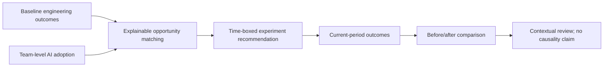
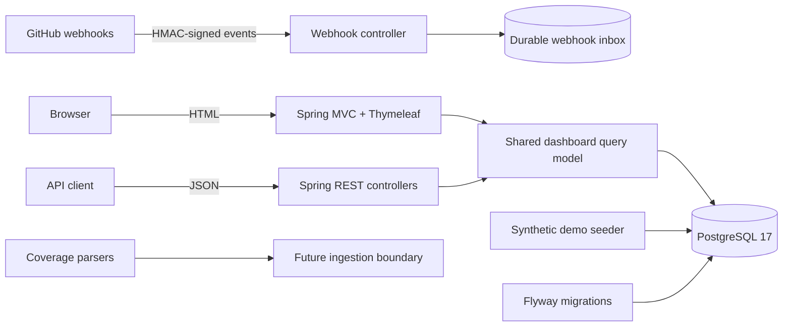
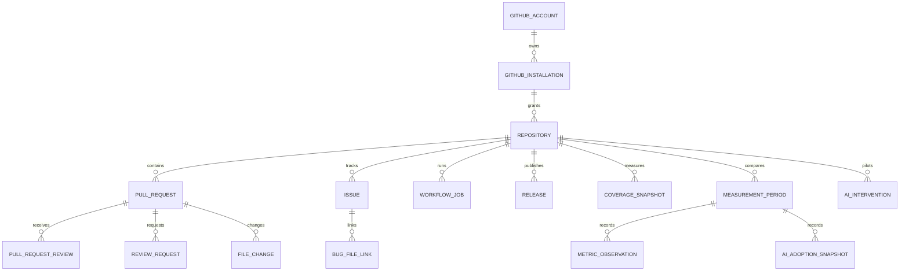

# GitHub Engineering Intelligence — Product and Architecture

Last updated: 2026-09-18

## Product goal

Help engineering teams understand delivery performance, identify responsible AI-assistance opportunities, and measure whether engineering outcomes changed after a time-boxed intervention—without scoring or monitoring individuals.

The implemented personal demo answers:

1. Where is delivery flow constrained?
2. Which engineering signals changed between a baseline and current period?
3. Which AI capabilities are underused at the team level?
4. Which bounded experiment is supported by both an engineering constraint and an adoption gap?
5. How complete and trustworthy is the evidence?

## Current implementation scope

The current release is a credential-free, synthetic vertical slice. It includes:

- Java 21 and Spring Boot 3.5 API.
- Spring MVC and Thymeleaf server-rendered dashboard.
- PostgreSQL 17 with four Flyway migrations.
- Personal and organization configuration modes.
- Synthetic repository, PR, review, issue, file, CI, release, coverage, bug-link, adoption, period, and intervention evidence.
- GitHub webhook HMAC-SHA256 verification and idempotent durable inbox.
- JSON metrics API backed by the same query model as the HTML dashboard.
- Explainable, deterministic AI opportunity rules.
- JaCoCo XML, Cobertura XML, and LCOV parsing.
- OIDC/JWT enforcement in organization mode.
- Configurable minimum-cohort privacy suppression.
- Gradle unit and PostgreSQL/Testcontainers integration tests.
- Docker Compose local environment and GitHub Actions CI.

## Current non-goals and limitations

- No individual productivity score, ranking, leaderboard, or comparison.
- No inference of effort or performance from commit counts, lines changed, working hours, or after-hours activity.
- No claim that AI caused an observed outcome change; the UI explicitly labels the comparison as correlation.
- No live GitHub historical backfill yet.
- No webhook-to-normalized-evidence processor yet; webhook deliveries are authenticated and stored only.
- No live AI-tool telemetry ingestion; adoption values in the personal demo are synthetic team survey evidence.
- No coverage-report upload endpoint yet; parsers are implemented and tested.
- No team, portfolio, or enterprise roll-up UI yet.
- No production deployment/incident linkage or DORA reliability calculation yet.
- Organization mode is not production-ready until tenant-aware query authorization and role mapping are completed.

## Implemented signal contract

| Dimension | Signal | Implemented definition |
|---|---|---|
| Speed | PR cycle time | Median elapsed calendar hours from PR opened to merged. |
| Flow | Review wait | Median elapsed hours from review request to recorded fulfillment. |
| Flow | Work in progress | Count of currently open pull requests. |
| Effort | Rework | Synthetic period-level percentage for the AI-impact demo; live event derivation is pending. |
| Quality | Test coverage | Latest imported file line coverage; paths below 70% are highlighted. |
| Quality | Bug hotspot | Count of bug-labelled issues linked to fixing-PR paths. |
| Change risk | PR size signal | Transparent heuristic using churn and changed-file count. |
| Maintainability | Change frequency | PR/file-change occurrences and churn per path. |
| CI | Flaky-job candidate | Same workflow job and commit contains both failure and success conclusions. |
| Planning | Issue aging | Open issues grouped into 0–7, 8–30, and 31+ day bands. |
| Delivery | Release frequency | Non-prerelease releases in the trailing 90 days divided by three. |
| Resilience | Review concentration | Largest share of pending review demand, hidden below the configured cohort threshold. |

Full formulas and limitations are in `docs/metric-definitions.md`.

## AI Opportunity and Engineering Impact slice

Implemented rules:

- Testing adoption below 50% plus coverage below 80% suggests an AI-assisted testing pilot.
- PR-review adoption below 50% plus review wait above eight hours suggests an AI-assisted PR-preparation pilot.
- Coding adoption below 50% plus cycle time above 48 hours suggests a narrowly scoped coding-agent pilot.

The rules are visible, deterministic, and tested. They recommend an experiment rather than an automated management decision.

## Runtime architecture

The checked-in Python worker directory is a reserved future boundary. It is not currently required to run the dashboard. Historical GitHub backfill and asynchronous normalization may be implemented there or in Java after measuring operational needs.

## PostgreSQL model

Schema boundaries:

- `integration`: GitHub accounts, installations, webhook deliveries, and sync boundaries.
- `evidence`: normalized engineering evidence.
- `analytics`: measurement periods, metric observations, AI adoption snapshots, and interventions.

### Migration history

| Version | Purpose |
|---|---|
| V1 | Durable, idempotent webhook inbox. |
| V2 | Tenant-aware GitHub account, installation, and repository foundation. |
| V3 | PR, review, file, issue, CI, release, coverage, and bug-link evidence. |
| V4 | AI adoption, measurement periods, outcomes, and interventions. |

## Deployment modes

### Personal mode

- Default mode.
- Docker Compose PostgreSQL and API.
- Synthetic evidence seeded at startup.
- No GitHub or identity credentials required.
- Local APIs are permitted without OIDC.

### Organization mode

- Same code and tenant-aware schema.
- Synthetic data disabled.
- OIDC/JWT authentication required for non-webhook APIs.
- Minimum cohort defaults to five.
- A strong non-development webhook secret is required.
- Still requires tenant-aware query authorization, role mapping, approved secrets, and security review before production use.

## Security and responsible-use guarantees

- Webhook signatures are compared in constant time against the exact request body.
- Delivery IDs provide webhook idempotency.
- Organization mode refuses unsafe demo, OIDC, cohort, or webhook-secret settings.
- No source code, diff contents, PR bodies, issue bodies, or comments are required by the current evidence model.
- Coverage XML parsing blocks document types and external entities.
- Team workload concentration is suppressed below the configured cohort threshold.
- AI opportunity rules use aggregate evidence and never output an individual recommendation.
- Secrets belong in environment injection or an approved secret manager, never Git or prompts.

## Test architecture

- Unit tests for webhook signatures, configuration guardrails, coverage parsing, and opportunity matching.
- PostgreSQL/Testcontainers tests for migrations, inbox idempotency, demo seeding, JSON metrics, and HTML rendering.
- Official GitHub webhook HMAC fixture.
- Docker Compose runtime verification against PostgreSQL 17.
- Current verified result: 15 tests, zero failures, zero skipped when Docker is available.

## Delivery status

| Milestone | Status |
|---|---|
| Repository, Gradle, Docker, CI, and documentation foundation | Complete |
| Secure webhook ingress and durable inbox | Complete |
| Tenant-aware database foundation | Complete |
| Synthetic engineering evidence | Complete |
| Server-rendered dashboard and JSON metrics API | Complete |
| Coverage parsers | Complete |
| AI adoption, opportunity matching, and before/after demo | Complete |
| GitHub App lifecycle and historical backfill | Not started |
| Webhook normalization/reconciliation worker | Not started |
| Live coverage and AI-adoption ingestion | Not started |
| Team/portfolio/enterprise aggregation | Not started |
| Production authorization, operations, and deployment | Partial |

## Recommended next milestone

Implement the real GitHub evidence path without changing the synthetic demo:

1. GitHub App installation lifecycle and short-lived installation tokens.
2. Repository allowlisting and checkpointed historical backfill.
3. Replay-safe normalization of PR, review, issue, workflow, and release webhooks.
4. Data freshness, reconciliation, retry, and dead-letter operations.
5. Repository-scoped tenant authorization.
6. Golden-dataset validation between live-normalized evidence and the existing metric contract.

Real organization connectivity must wait for administrator approval, an approved hosting environment, retention policy, identity configuration, and secret-manager integration.
