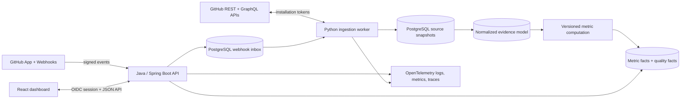

# GitHub Engineering Intelligence Dashboard

## MVP product brief

### Product goal

Give engineering leaders and teams an evidence-based view of delivery flow and software reliability using GitHub system data, without ranking or monitoring individuals.

The MVP should help a team answer:

1. How smoothly does work move from first commit to production release?
2. Where does pull-request flow accumulate delay or rework?
3. Are releases becoming safer and easier to recover from?
4. How complete and trustworthy is the underlying evidence?

### Intended users

- Engineering managers: identify process constraints and discuss trends with teams.
- Staff engineers and platform teams: find systemic review, CI, and release bottlenecks.
- Engineering executives: view organization-level trends with explicit data-quality context.
- Repository administrators: configure access, repositories, teams, and collection health.

### MVP scope

The first release supports one GitHub organization and selected repositories. It provides:

- A GitHub App installation using least-privilege, read-only repository access.
- Initial backfill plus webhook-driven incremental ingestion.
- Collection of repository metadata, pull requests, reviews, issues, commits/change statistics, workflow runs/jobs, deployments, and releases.
- Organization, team, repository, and time-range filters.
- Delivery-flow and reliability metrics at team/repository or higher aggregation.
- Metric definitions, provenance, confidence/data-completeness indicators, and drill-down to contributing events.
- Collection health, webhook status, sync lag, and audit events.
- A documented demo dataset that contains no real employee data.

### Explicit non-goals for the MVP

- Individual productivity scores, rankings, leaderboards, or comparisons.
- Keystroke, active-time, commit-count, lines-of-code, or after-hours activity measures as performance proxies.
- Performance-management recommendations or automated judgments about people.
- GitHub Enterprise Server, multiple source-control providers, predictive analytics, or AI-generated management advice.
- Full incident-management integration. The MVP can calculate recovery-related metrics only when deployment/rollback evidence is sufficiently trustworthy.
- Exact semantic linkage among issues, pull requests, deployments, and incidents when the organization has not supplied a reliable convention.

## Metrics contract

Every metric must have a versioned definition, numerator/denominator or event formula, inclusion rules, exclusions, time-zone handling, source fields, freshness, and known limitations.

### MVP metrics

| Area | Metric | MVP definition |
|---|---|---|
| Delivery | PR cycle time | Median and percentile time from PR opened to merged, split into pickup time and active review time where evidence allows. |
| Delivery | Review responsiveness | Time from review request (or PR ready-for-review fallback) to first substantive review. |
| Delivery | Merge throughput | Merged PR count per week, shown only as a team/repository trend and never as an individual target. |
| Delivery | Work in progress | Open, non-draft PRs and age bands at the selected aggregate. |
| Quality | Change/rework proxy | Follow-up commits after requested changes and reopened PRs, labeled as a process signal rather than developer quality. |
| CI | CI success rate | Successful completed qualifying workflow runs divided by completed qualifying runs. |
| CI | Time to green | Time from the first qualifying run for a commit/PR to the first successful qualifying run. |
| Reliability | Deployment frequency | Successful production deployments per period, only for environments mapped as production. |
| Reliability | Change failure proxy | Production deployments followed by a rollback/revert or linked corrective deployment inside a configured window. Hidden if linkage quality is insufficient. |
| Reliability | Recovery time proxy | Time from detected failed production deployment to successful corrective deployment. Hidden if linkage quality is insufficient. |
| Operations | Data freshness/completeness | Sync lag, webhook gaps, API failures, and percentage of required evidence available for each metric. |

Issue lead time, release cadence, PR size distribution, and stale-work trends are useful secondary metrics. They should enter only after their semantics and expected decisions are validated with users.

### Responsible-use guardrails

- Aggregate to repository/team by default; suppress slices below a configurable minimum cohort or activity threshold.
- Never expose an individual leaderboard or a cross-team ranking.
- Do not infer effort, hours worked, developer quality, or performance from activity traces.
- Present distributions and trends, not a single composite score.
- Attach context and uncertainty to every reliability proxy.
- Keep raw-content collection minimal: prefer IDs, timestamps, states, relationships, and aggregate change counts; do not ingest source code, PR bodies, comments, or diff contents for the MVP.
- Make metric configuration and definition changes auditable.
- Document permitted use and explicitly prohibit employment decisions based solely on dashboard data.

## Proposed MVP architecture

Use a modular monolith plus a separately scalable worker. This keeps deployment and data consistency manageable while preserving clear boundaries for later extraction.

### Technology choices

- **Backend/API:** Java 21, Spring Boot, Spring Security, jOOQ or Spring JDBC, Flyway, and Testcontainers.
- **Ingestion/analytics worker:** Python 3.13, httpx, Pydantic, SQLAlchemy Core, and pytest. Python handles GitHub pagination, replay, transformation, and metric batches without coupling them to request latency.
- **Frontend:** React and TypeScript with an accessible charting library. The dashboard should expose metric definitions and underlying evidence, not just charts.
- **Database:** PostgreSQL 17. It acts as the transactional store, durable webhook inbox, job queue for the MVP, normalized evidence store, and aggregate mart.
- **Observability:** OpenTelemetry instrumentation, Prometheus-compatible metrics, structured logs, and Grafana dashboards in local/demo deployments.
- **Packaging:** Dockerfiles per service and Docker Compose for local development/demo. Production manifests are deferred until a target platform is selected.

If portfolio breadth is less important than delivery speed, the API and worker can both be Python. The Java/Python split is justified only if demonstrating typed enterprise API design and data engineering together is an explicit portfolio goal.

### Logical modules

1. `identity-access`: dashboard login, organization roles, repository scopes, audit records.
2. `github-integration`: GitHub App installation state, encrypted secrets, token exchange, webhook signature validation.
3. `ingestion`: durable event inbox, backfill cursors, API rate-limit handling, retry/dead-letter state, reconciliation.
4. `evidence`: normalized repositories, teams, PRs, reviews, issues, workflow runs/jobs, deployments, releases, commits, and change summaries.
5. `metrics`: versioned definitions, computation windows, quality rules, aggregate facts.
6. `query-api`: filters, trends, comparisons to the same aggregate's prior period, provenance drill-down.
7. `operations`: health, lag, failures, rate-limit budget, replay, and audit views.

### Data-flow guarantees

- Verify the webhook HMAC before persisting an event.
- Persist deliveries idempotently by GitHub delivery ID.
- Acknowledge only after durable inbox storage; process asynchronously.
- Use upserts keyed by GitHub node/database IDs and installation/repository scope.
- Store checkpoints for every backfill stream and reconcile periodically to heal missed events.
- Record source timestamps separately from observed and processed timestamps.
- Retain raw webhook payloads briefly for replay, encrypted where supported, then expire them; retain normalized minimal evidence according to policy.
- Make derived metric facts reproducible by storing metric version, window, source watermark, and computation timestamp.

### Initial PostgreSQL boundaries

- `integration`: installations, repositories-in-scope, sync cursors, webhook deliveries, ingestion jobs.
- `evidence`: repositories, teams, pull requests, reviews, issues, commits, workflow runs/jobs, environments, deployments, releases, linkage records.
- `analytics`: metric definitions, metric runs, metric facts, quality facts, calendar dimensions.
- `iam`: users, organization roles, sessions/identity mappings, audit events.

Partition high-volume delivery and workflow event tables by source event month only after measurements justify it. Apply migrations from one owner; services should not mutate schema independently.

### Security baseline

- Use a GitHub App, not a personal access token. Request read-only metadata, pull request, issue, checks/actions, deployment, and contents-metadata permissions only when each dataset needs them.
- Store the App private key and webhook secret in a secret manager outside source control; encrypt installation-sensitive data at rest.
- Validate webhook signatures against the exact request bytes, enforce body-size limits, and reject stale/replayed deliveries through idempotency records.
- Use short-lived installation access tokens and never persist them.
- Provide dashboard authentication through OIDC, organization-scoped authorization, secure cookies, CSRF protection, and least-privilege database roles.
- Redact secrets and content from structured logs; emit security-relevant audit events.
- Pin dependencies and container base images, generate an SBOM, scan code/dependencies/images, and sign release images in CI.
- Publish a threat model before any internet-facing deployment.

## Milestone backlog

### M0 — Product contract and repository foundation

Exit criteria: stakeholders can agree what decisions the product supports and what uses it forbids.

- Confirm personas, organization shape, target hosting environment, and data-retention constraints.
- Write metric definition records and a responsible-use policy.
- Create architecture decision records for language split, GitHub App permissions, PostgreSQL, tenancy, and raw-event retention.
- Scaffold the monorepo, local tooling, formatting/linting, test conventions, Compose, and CI skeleton.
- Add C4 context/container diagrams and an initial threat model/data-flow diagram.

### M1 — Secure GitHub ingestion vertical slice

Exit criteria: a test GitHub App installation can backfill and incrementally update repositories and pull requests with observable, idempotent processing.

- Implement installation setup and secret configuration.
- Add signed webhook endpoint and durable inbox.
- Add repository/PR/review backfill, pagination, rate-limit budgeting, checkpoints, retries, and dead letters.
- Create Flyway migrations and evidence repositories.
- Add contract fixtures, unit tests, integration tests with PostgreSQL, and webhook replay tests.
- Expose collection-health endpoints and telemetry.

### M2 — Delivery-flow dashboard

Exit criteria: users can see trustworthy PR cycle, responsiveness, throughput, WIP, and data quality for selected repositories and periods.

- Implement versioned metric definitions and calculation runs.
- Add aggregate/query API with authorization and caching semantics.
- Build accessible overview, trend, distribution, and definition/provenance views.
- Add minimum-cohort suppression and responsible-use copy.
- Validate calculations against hand-worked golden datasets.

### M3 — CI and release evidence

Exit criteria: qualifying workflows and production environments can be configured, and CI/release trends are reproducible.

- Ingest workflow runs/jobs, deployments, environments, and releases.
- Add CI success rate, duration, queue time, time-to-green, deployment frequency, and release cadence.
- Build mapping/configuration UI for qualifying workflows and production environments.
- Add scheduled reconciliation and missing-event detection.

### M4 — Reliability metrics with confidence gates

Exit criteria: reliability proxies appear only when required deployment and recovery linkage reaches an explicit quality threshold.

- Define rollback/revert/corrective-deployment linkage strategies.
- Compute change-failure and recovery proxies with confidence labels.
- Add evidence drill-down and an explanation of missing/ambiguous linkage.
- Test boundary cases, late-arriving evidence, recomputation, and definition-version changes.

### M5 — Production hardening and portfolio demo

Exit criteria: a reviewer can clone, run, test, inspect, and securely demo the system from documented instructions.

- Add OIDC/RBAC, audit views, retention jobs, backup/restore runbook, SLOs, alerts, and load tests.
- Harden containers, add SBOM/scanning/signing, dependency updates, and release automation.
- Produce deployment guidance for the selected platform and disaster-recovery expectations.
- Add seeded synthetic organization data and a scripted demo journey.
- Complete README, contributor guide, API documentation, operations runbook, security policy, architecture decision log, and limitations/ethics documentation.

## Testing strategy

- Unit tests for normalization, linkage, metric formulas, cohort suppression, and authorization rules.
- Property tests for time windows, percentile calculations, deduplication, and event ordering.
- Golden-dataset tests containing hand-calculated expected metrics.
- Integration tests against real PostgreSQL using Testcontainers.
- Consumer/API contract tests between UI, Java API, and Python worker schemas.
- GitHub fixture tests for pagination, rate limits, partial responses, redelivery, out-of-order events, and permission loss.
- End-to-end tests for installation-to-dashboard flows using synthetic fixtures.
- Security tests for signature validation, tenant isolation, injection, broken access control, and secret redaction.
- Performance tests based on a documented organization-size profile.

## Scope decisions to confirm before implementation

These answers materially affect the data model and first vertical slice:

1. **Portfolio objective:** optimize for fastest polished demo, or explicitly showcase both Java enterprise services and Python data engineering?
2. **Tenancy:** one organization for the portfolio MVP, or multi-organization isolation from day one?
3. **Deployment evidence:** does the target organization use GitHub Deployments/Environments, releases/tags, or an external deployment system as the source of truth?
4. **Identity and teams:** use GitHub teams as the reporting boundary, or support a separately managed team-to-repository mapping?
5. **Hosting target:** local Docker demo only initially, or a specific cloud/Kubernetes target?
6. **History and retention:** desired backfill window and permitted retention for raw webhook payloads and normalized metadata?
7. **UI ambition:** executive overview only for MVP, or overview plus repository drill-down and metric provenance?

## Recommended defaults

Unless product constraints say otherwise, start with one organization, repository/team aggregation, GitHub teams, twelve months of backfill, seven days of encrypted raw webhook retention, indefinite retention of minimal normalized metadata and aggregate facts, GitHub Deployments as the production source of truth, and an overview plus provenance drill-down. Use Java for the API and Python for ingestion/metrics only if the dual-language portfolio story is intentional.

The first implementation slice should be deliberately narrow: install a test GitHub App, ingest repository and pull-request evidence idempotently into PostgreSQL, compute one versioned PR-cycle-time metric from a golden dataset, and display it with freshness and provenance. That slice proves the architecture before additional GitHub domains are added.
